# Summary
- Calculate the number of disconnected component in given graph
- Edges are coming in stream i.e. we don't have predefined list of edges
- can't apply dfs/bfs optimally
# Basic Union and Find i.e. Quick Find
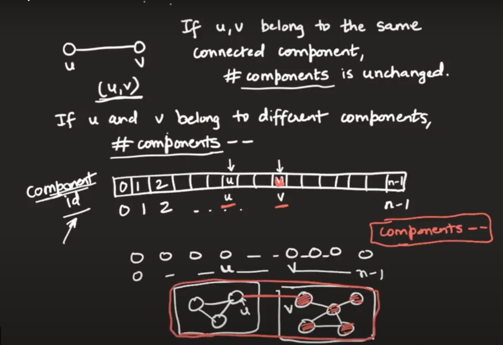
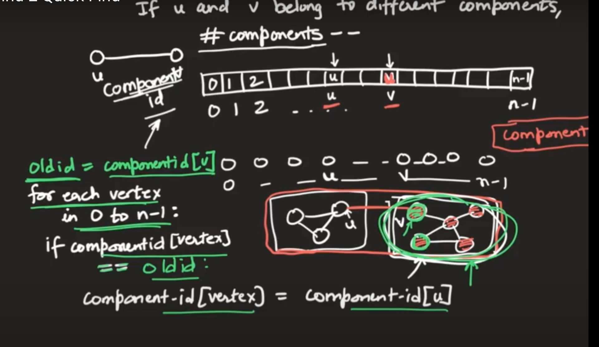
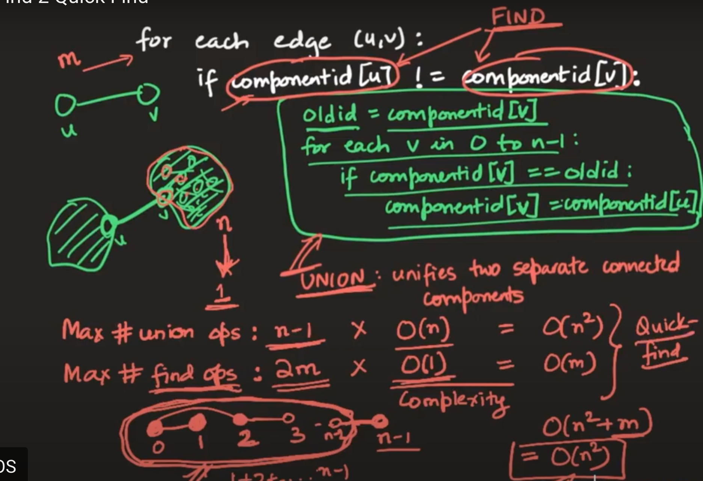
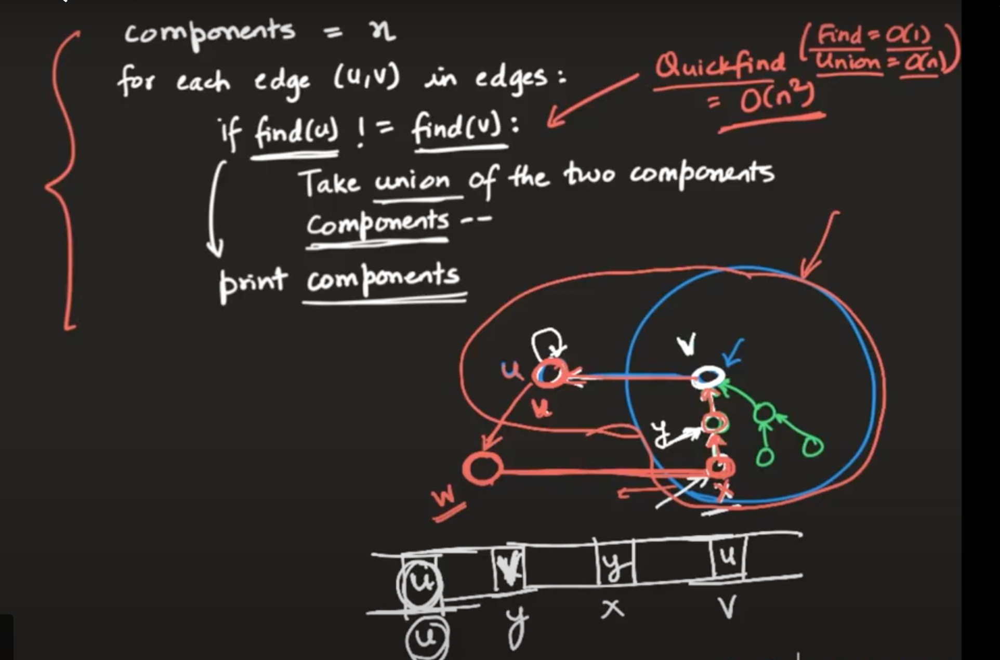
# Improved Union and Find i.e. Quick Union
- Religion of king will be followed by rest in that component
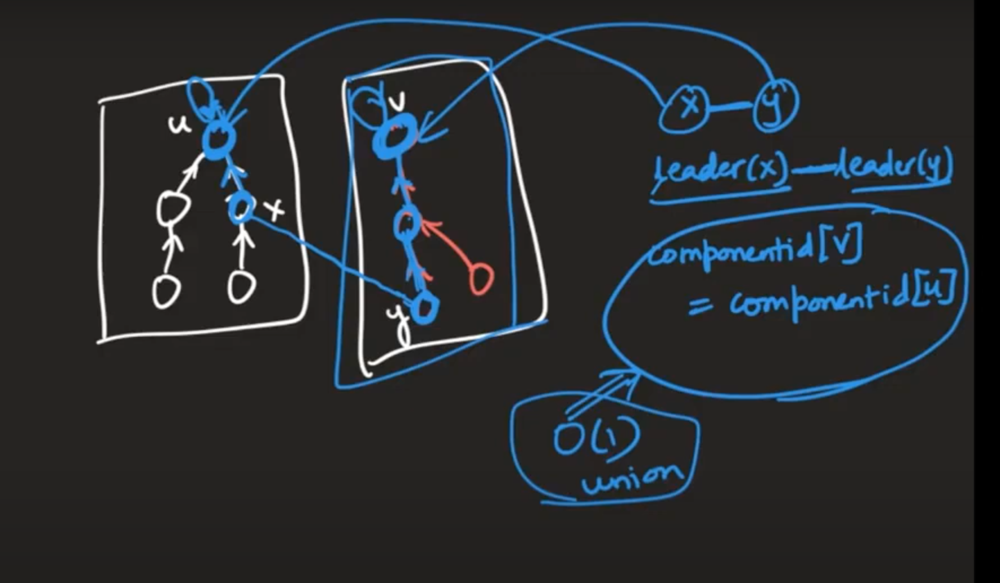
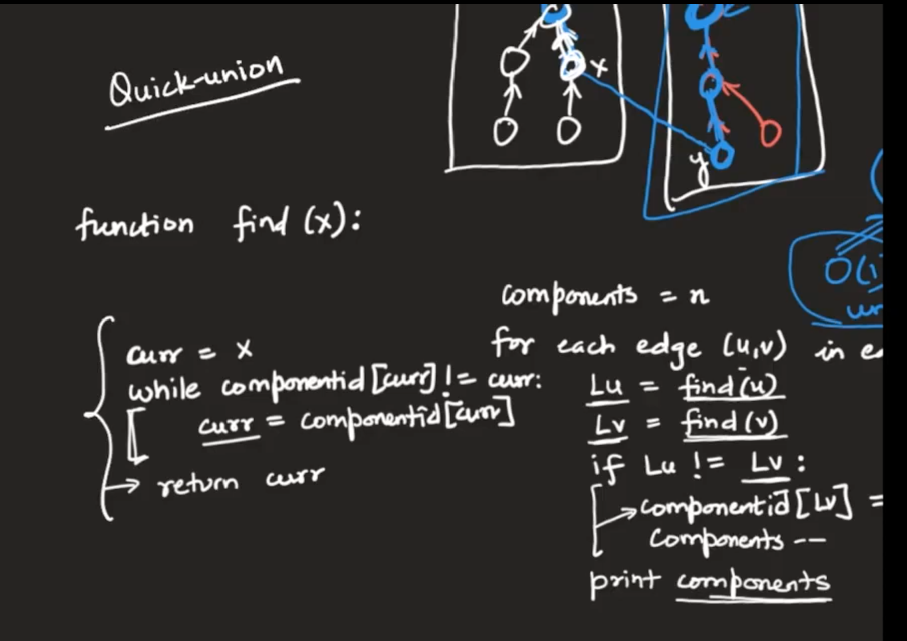
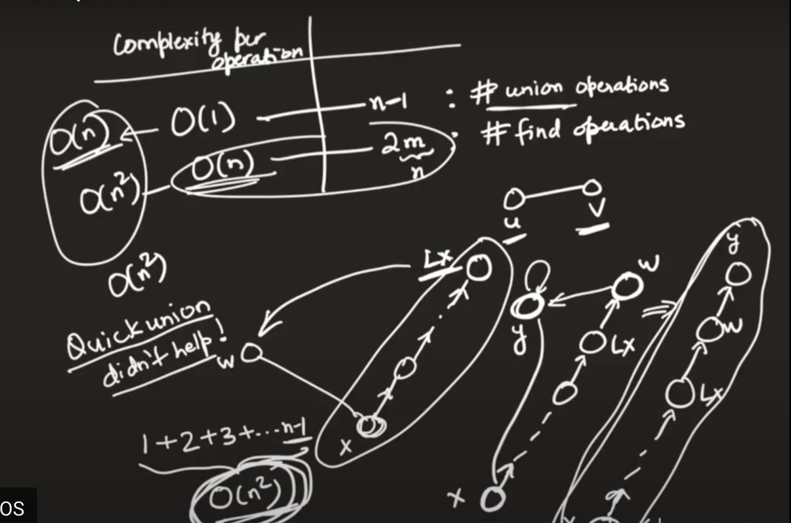
# Weighted Quick Union and Find
- Goal is to minimize the height of the tree
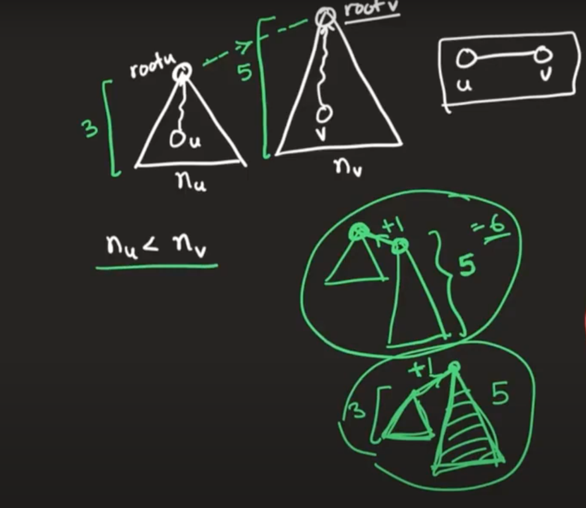
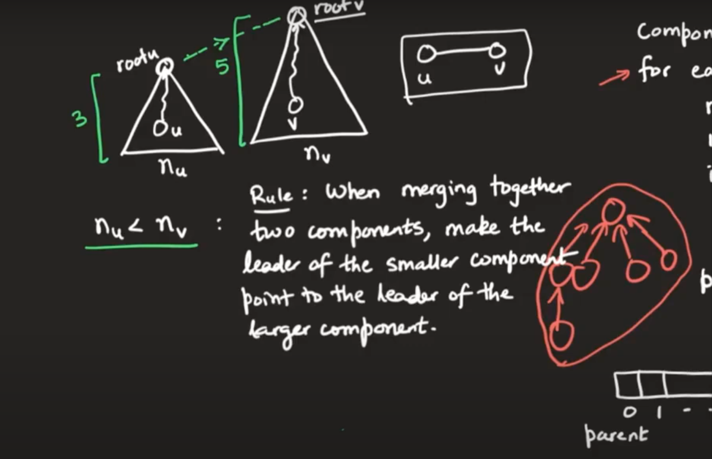
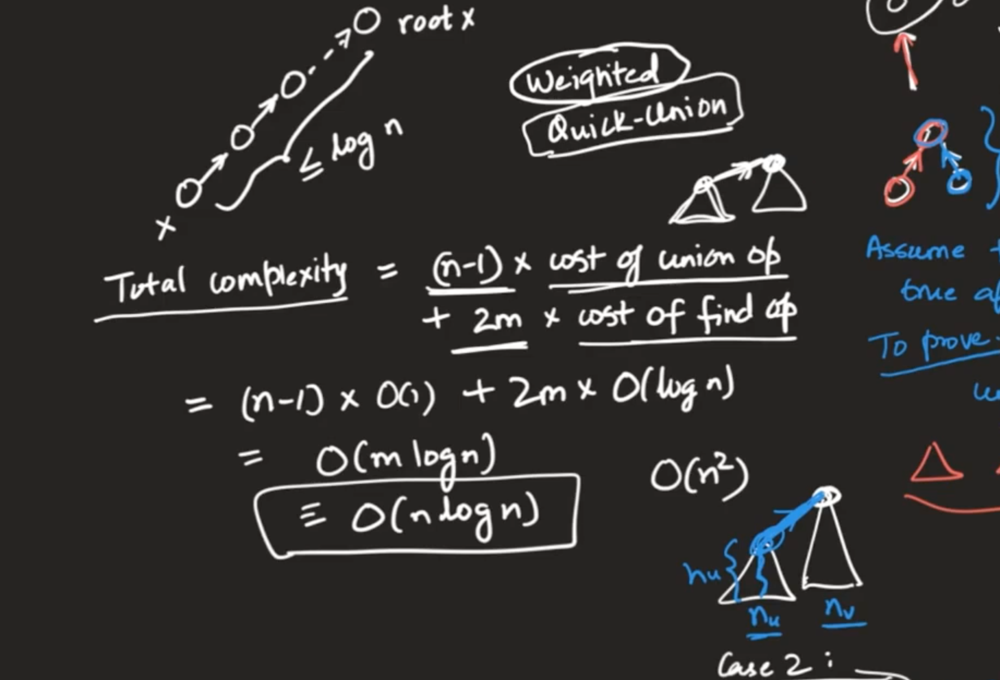
# Optimzed Union and Find using path compression
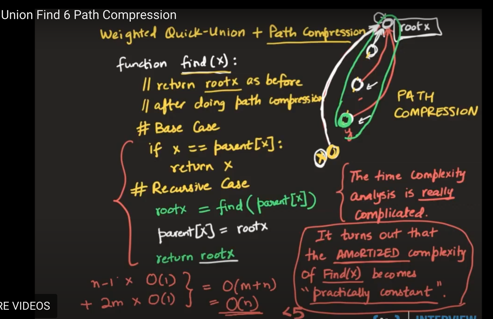
